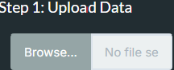
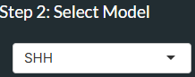
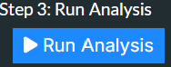
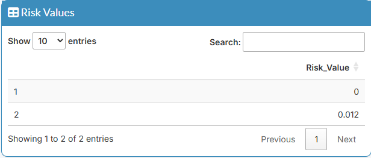
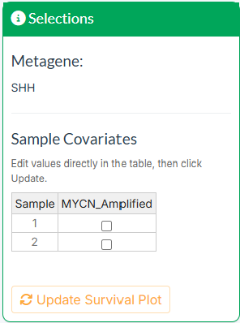
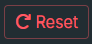

# Step One - Uploading Data
Upload your idat files (unzipped only), including both red and green channel files for each sample.

Increasing the number of samples uploaded will increase processing time, so we recommend batches of ~10 samples for the best experience.

# Step Two - Selecting a Model
Select the model appropriate for your samples. Three models are available:

- **SHH** — for Sonic Hedgehog subgroup medulloblastoma
- **Group3/4 (Early)** — for Group 3/4 medulloblastoma - metaCpG for predicting OS at 5 years
- **Group3/4 (Late)** — for Group 3/4 medulloblastoma - metaCpG for predicting OS at 10 years

# Step Three - Run Analysis
Press the **Run Analysis** button to begin processing.

A progress bar will appear in the sidebar indicating the current stage of the analysis. 
Processing time will vary depending on the number of samples uploaded.

# Step Four - Results
Once the analysis is complete you will be brought to the Results tab. This contains several sections:

## Risk Values Table
A table displays your sample names and their corresponding risk scores. 
Click any row to select that sample — it will be highlighted in orange on the risk plot.

## Risk Plot
Shows the distribution of risk scores across your uploaded samples, with the 
currently selected sample highlighted in orange.

## Selections and Clinical Covariates
The green box shows the currently selected metagene model. It also contains an editable 
covariate table which allows you to set clinical information for each sample individually:

- **SHH model** — set *MYCN* amplification status (yes/no) per sample
- **Group3/4 (Early) model** — set *MYC* amplification status and metastatic status (yes/no) per sample
- **Group3/4 (Late) model** — no covariates required

Edit the covariate table directly by ticking or unticking the checkboxes for each sample, 
then press **Update Survival Plot** to apply the changes.

## Survival Estimate
Shows the estimated survival distribution for the training cohort as a density plot, 
with a dashed vertical line indicating where each of your samples falls.
The currently selected sample is highlighted in orange; all others are shown in grey.

The survival estimate header also displays:
- The **name** of the currently selected sample
- The **estimated survival probability** at 5 years (SHH and Group3/4 (Early)) or 10 years (Group3/4 (Late))

> **Note:** Survival estimates are derived from a Cox proportional hazards model trained on 
> published medulloblastoma cohort data. These estimates are for research purposes only and 
> must not be used for clinical decision making.

# Step Five - Export Data and Reset

## Downloading Results
Click the **Download** tab to export your results. Two formats are available:

- **CSV** — exports the risk value table
- **PDF** — exports a multi-page document containing:
  - The risk value table
  - The risk plot and survival estimate plot
  - A text summary of the selected sample's estimated survival
  - The covariate table (SHH and Group3/4(Early) models only)

Enter a filename before downloading, or leave the default.

## Resetting the App
Press the **Reset** button in the sidebar to clear all uploaded data and return 
the app to its initial state. This should be done between batches of samples.

> **Disclaimer:** This app is designed exclusively for research purposes and is 
> strictly not for diagnostic or clinical use.